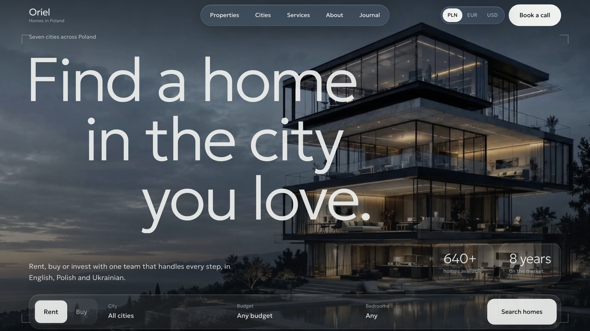

# Oriel Homes


> A modern real-estate website concept for finding, renting, buying and investing in homes across Poland.

**Live Demo:** https://oriel-home.vercel.app

## Overview

Oriel is a polished real-estate web experience designed around a simple idea: make finding a home in Poland feel clear, calm and trustworthy.

The project focuses on a premium editorial-style interface combined with practical property discovery features, multilingual communication and a conversion-oriented user journey.

The website is built as a portfolio concept, with fictional properties, company information and contact details.

## ✨ Features

* 🏠 Property discovery experience
* 🔎 Search with city, budget and bedroom filters
* 🏙️ City-focused navigation
* 💼 Rent / Buy user flows
* 📋 Services and property support sections
* 📖 Editorial-style Journal section
* 💬 Contact / enquiry form
* 🌍 Multilingual positioning — English, Polish and Ukrainian
* 💱 Currency selector — PLN, EUR and USD
* 📱 Responsive design for desktop and mobile
* 🔐 Privacy policy and consent-focused UX
* ⚡ Deployed on Vercel

## 🛠️ Tech Stack

* React
* Next.js
* TypeScript
* Tailwind CSS
* Vercel
* Git & GitHub

## 🎨 Design Direction

The visual direction combines a premium real-estate aesthetic with a clean editorial layout.

The interface was designed with emphasis on:

* typography and visual hierarchy
* generous whitespace
* neutral, natural colour palette
* high-quality property imagery
* subtle interactions and transitions
* clear calls to action
* responsive layouts
* accessibility and usability

The goal was to create a product that feels closer to a real estate brand website than a typical template or generic landing page.

## 🤖 AI-Assisted Development

AI tools were incorporated into the development workflow for exploration, implementation support and iteration.

They were used as part of the development process for tasks such as:

* exploring UI and UX directions
* generating and refining implementation ideas
* assisting with component development
* iterating on layouts and responsive behaviour
* improving and reviewing parts of the code
* accelerating repetitive development tasks

The final interface, visual direction, structure and implementation decisions were reviewed and refined as part of the development process.

This project reflects a workflow where AI is used as a development tool while keeping product decisions, design direction and final implementation under human control.

## 📁 Project Structure

```text
.
├── app/
│   ├── components/
│   ├── ...
│   └── page.tsx
├── components/
│   ├── ...
├── public/
│   ├── images/
│   └── ...
├── package.json
└── README.md
```

## 🚀 Getting Started

### Prerequisites

* Node.js 18+
* npm

### Installation

```bash
git clone <repository-url>
cd oriel-home
npm install
```

### Development

```bash
npm run dev
```

Open:

```text
http://localhost:3000
```

### Production Build

```bash
npm run build
npm run start
```

## 🌐 Deployment

The project is deployed with Vercel.

**Live:** https://oriel-home.vercel.app

## 📌 Project Status

This is a portfolio concept created to demonstrate frontend development, UI/UX implementation and modern AI-assisted development workflows.

All company information, listings, statistics and contact details shown on the website are fictional.

---

### Author

**Daria**

Frontend Developer focused on creating polished, responsive and user-centred web experiences.

[GitHub](https://github.com/daria-tsevashova)
